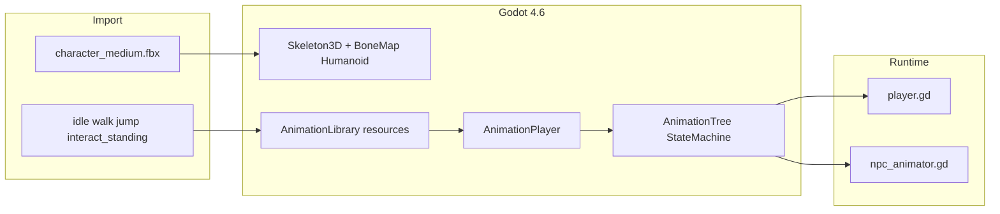

# Kenney Animated Characters — Asset Cleanup and In-Game Swap

## Current state


| Role         | Scene / node                                                                                         | Visual today |
| ------------ | ---------------------------------------------------------------------------------------------------- | ------------ |
| Visitor      | [scenes/player/player.tscn](scenes/player/player.tscn) — blue capsule                                | No animation |
| Mathew (you) | [scenes/town/town_square.tscn](scenes/town/town_square.tscn) — `MathewDeeb/Fountain` orange cylinder | No animation |


Movement and dialogue already exist in [scripts/player.gd](scripts/player.gd) and [scripts/interaction_manager.gd](scripts/interaction_manager.gd) (`movement_locked` during dialogue). No `AnimationPlayer` / `AnimationTree` anywhere yet.

**Bundle source:** Kenney *Animated Characters Bundle 4.0* (CC0) at [Animated Characters Bundle/](Animated%20Characters%20Bundle/) — modular FBX rig, separate animation FBX files, PNG skins. There is **no** clip named `talk`; Kenney provides `**interactStanding.fbx**` for standing interaction/gesture (maps to your “talk” requirement).

**Your choices:** two in-world bodies; both use `**businessMaleA.png**` on `**characterMedium.fbx**`.

---

## Phase 1 — Clean up and reorganize assets

Remove itch.io boilerplate and keep only what the game needs (~60MB → ~5–8MB committed).

**Delete or exclude from the project (not copied to `assets/`):**

- `Preview/`, `Preview.png`
- All `Source/` trees (`.blend`, `.svg`, `.ai`) under Models, Animations, Skins, Accessories
- `Accessories/` (40+ prop FBX files)
- `Skins/Animals/`
- Unused model variants: `characterLargeMale`, `characterLargeFemale`, `characterSmall` (unless you want size contrast later)
- Unused animations: everything except `idle`, `walk`, `jump`, `interactStanding`

**Target layout:**

```text
assets/characters/kenney/
  LICENSE.txt              # from bundle License.txt
  models/
    character_medium.fbx
  animations/
    idle.fbx
    walk.fbx
    jump.fbx
    interact_standing.fbx  # “talk”
  skins/
    business_male_a.png
```

**Repo hygiene:**

- Remove the top-level [Animated Characters Bundle/](Animated%20Characters%20Bundle/) folder after migration.
- Add a one-line credit in [README.md](README.md) (Kenney / CC0) — optional but appreciated per license.

---

## Phase 2 — Godot animation pipeline (research summary)

Kenney ships **one rigged mesh FBX** plus **animation-only FBX files**. Godot 4.6 (native **ufbx** importer, project uses **GL Compatibility**) handles this with **skeleton retargeting**, not by merging files in Blender (unless retargeting fails in testing).




### Step 2a — Import the base character

1. Copy `character_medium.fbx` into `assets/characters/kenney/models/`.
2. In the **Import** dock (Advanced):
  - Enable **retargeting** with `**SkeletonProfileHumanoid**` and a **BoneMap** on the skeleton ([Godot 4.6 retargeting docs](https://docs.godotengine.org/en/4.6/tutorials/assets_pipeline/retargeting_3d_skeletons.html)).
  - Disable **Generate LODs** for skinned characters (known mesh/skin issues).
3. Reimport and confirm the imported scene has `Skeleton3D`, mesh, and a rest pose that looks like Kenney’s T-pose.

### Step 2b — Import the four animation FBX files

For each file in `assets/characters/kenney/animations/`:

1. Import as **animation library** shared with the base skeleton (same BoneMap / humanoid profile).
2. On the **base model** import, enable **“Remove Tracks Unmatched by Rest Pose”** (and related retarget options per docs) so clips from separate FBX files drive the same bones.
3. If a clip looks twisted or offset, enable **Fix Silhouette** on the animation import (common Kenney + Godot fix per [issue #112516](https://github.com/godotengine/godot/issues/112516)); reimport model + anims together if needed.
4. Loop settings:
  - **Loop:** `idle`, `walk`, `interact_standing` (talk)
  - **One-shot:** `jump` (and optionally `interact_standing` if you prefer a single gesture)

Kenney’s own Godot section is minimal ([Kenney import guide](https://kenney.nl/knowledge-base/game-assets-3d/importing-characters-and-animations)); the retargeting workflow above is the practical Godot 4 path for separate animation FBX files.

### Step 2c — Apply skin texture

- Import `business_male_a.png`.
- On the character mesh material (inspector or import material slot), set **albedo** to that texture (Kenney UV layout is consistent across skins).

### Step 2d — Build a reusable character scene

Create [scenes/characters/kenney_character.tscn](scenes/characters/kenney_character.tscn):

```text
CharacterBody3D (or Node3D for NPC-only)
├── CollisionShape3D          # capsule ~ existing player/NPC sizes
├── Model                     # instanced imported FBX scene
│   └── Skeleton3D / meshes
├── AnimationPlayer           # libraries: idle, walk, jump, interact_standing
└── AnimationTree             # StateMachine root
```

Add [scripts/character_animator.gd](scripts/character_animator.gd) to own state transitions (keeps [player.gd](scripts/player.gd) focused on physics).

**AnimationTree state machine (recommended over raw `AnimationPlayer.play()`):**


| State  | Clip              | Enter when                                    |
| ------ | ----------------- | --------------------------------------------- |
| `idle` | idle              | on floor, speed ≈ 0, not talking              |
| `walk` | walk              | on floor, horizontal speed > threshold        |
| `jump` | jump              | `!is_on_floor()` or `just_pressed(jump)`      |
| `talk` | interact_standing | dialogue active (NPC always; player optional) |


Transitions: `immediate` for jump/talk entry; `at_end` or short crossfade when returning from one-shot jump to idle/walk.

**Alternative (simpler, fewer nodes):** single `AnimationPlayer` + script calling `play("walk")` / `play("idle")` with `travel` logic. Use AnimationTree if blending or conditions get messy.

---

## Phase 3 — Wire into Player and Mathew NPC

### Player ([scenes/player/player.tscn](scenes/player/player.tscn))

- Replace `Model/Body` capsule `MeshInstance3D` with instanced `kenney_character.tscn` (or embed the imported model subtree).
- Keep existing `CollisionShape3D`, camera, `InteractionManager`.
- In [scripts/player.gd](scripts/player.gd): after `move_and_slide()`, call animator with:
  - `is_moving` from `velocity.length()` on XZ
  - `is_on_floor()`, jump input
  - `Dialogue.is_active` → force **talk** while movement is locked (optional but matches your four-anim spec)

### Mathew Deeb ([scenes/town/town_square.tscn](scenes/town/town_square.tscn))

- Remove `Fountain` cylinder mesh (keep `Area3D`, collision, labels, `Interactable` script).
- Add child scene: `kenney_character.tscn` at NPC origin (Y offset so feet sit on ground).
- New small script or export on animator: `set_talking(true)` when `Dialogue.is_active` **and** focused interactable is this NPC (listen to `Dialogue.dialogue_started` / `dialogue_ended` from [scripts/interactable.gd](scripts/interactable.gd) or town script).
- Default NPC state: **idle**; **talk** during intro/about dialogue with Mathew.

**Differentiation with identical skin:** offset NPC spawn, scale slightly (e.g. 1.05), or rotate to face the square — both use `businessMaleA` per your choice.

---

## Phase 4 — Tuning and verification

Use Godot MCP Pro (already connected) where helpful:

1. **Editor:** `play_scene`, `capture_frames` — confirm walk cycle plays while moving, idle when still, jump on space, Mathew plays talk during dialogue.
2. **Fixes:** collision capsule height vs mesh feet; model `rotation.y` still driven by existing `model.rotation.y` in `player.gd`.
3. **Web export:** re-export and spot-check GL Compatibility + skinned mesh (no LOD on character import).

**Success criteria:**

- No `Animated Characters Bundle/` folder left at repo root.
- Player and Mathew are visible Kenney humanoids, not primitives.
- Four animations behave as specified (talk = `interact_standing`).
- Dialogue and movement locking unchanged functionally.

---

## Risk notes


| Risk                                      | Mitigation                                                               |
| ----------------------------------------- | ------------------------------------------------------------------------ |
| Retarget mismatch on anim-only FBX        | Humanoid BoneMap + Fix Silhouette; reimport all clips after model import |
| Root motion slides character              | Disable root motion on import or zero root bone tracks                   |
| Jump/talk fight while airborne + dialogue | Priority: jump > talk > walk > idle in animator logic                    |
| Large git diff                            | Omit Source/ and unused FBX; only 1 model + 4 anims + 1 PNG              |


